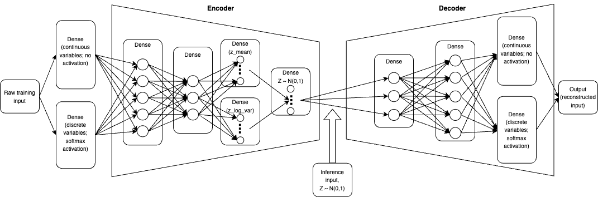

# Synthetic Data Generation  

## Project Summary  
This project was conducted for two primary reasons: to gain a better understanding of (variational) autoencoder architecture, and how this type of model can assist in generating synthetic healthcare-centered datasets. In this case, the "original" data is also synthetic in nature, as it is rooted in predefined discrete and continuous probability distributions depending on the input variable. In a professional or business environment, individuals will have real EHR or longitudinal health data available to them which would be used for model training.  

## Data Description  
There were various numeric and categorical variables used within both the original and synthetic datasets. The 6 numeric variables were *patient_age*, *patient_height_cm*, *patient_weight_kg*, *patient_systolic_bp*, *patient_diastolic_bp*, and *patient_heart_rate*. The 2 categorical variables were *patient_gender* and *patient_race*. Original data for these variables were drawn from various distributions, with some joint relationships being worked into the data creation.   

*patient_age* - drawn from uniform distribution, with a min value of 18 and a max value of 90.  
*patient_height_cm* - drawn from a normal distribution, with a base mean of 167 and base standard deviation of 6.5. If the patient was male, then 8 was added to the base mean, otherwise, 5 was subtracted. Additionally, male patients had 0.5 added to their base standard deviation, while female patients had 0.5 subtracted. Unknown or other genders remained at the base mean and base standard deviation.  
*patient_weight_kg* - derived from a body mass index random variable (which was drawn from a normal distribution with base mean of 27 and standard deviation of 5; male patients had 0.5 subtracted from the base mean, and patients older than 50 years had 1 added, with both conditions capable of being applied simultaneously). Weight was then calculated as $BMI * (\frac{height}{100})^2$. 
*patient_systolic_bp* - 
*patient_diastolic_bp* - 
*patient_heart_rate* - 

## Model Architecture & Parameters
The following pictures illustrates the VAE structure at a high level:  
  

**Encoder component**  

**Decoder component**  

**Combined model**

**Dataset comparisons**  