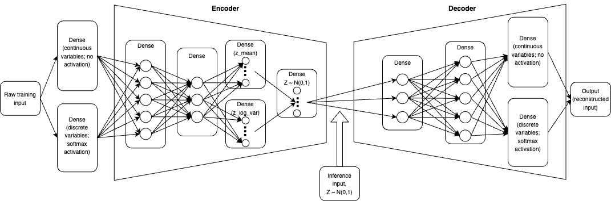
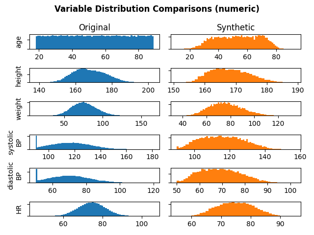
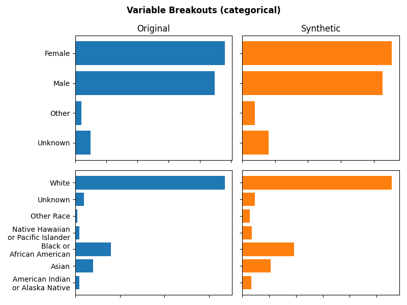
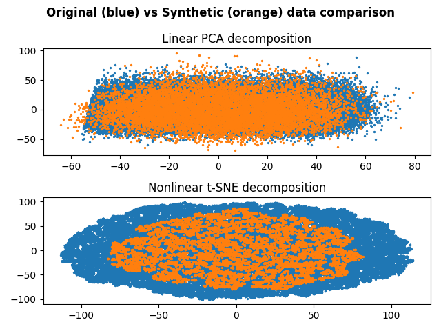

# Synthetic Data Generation  

## Project Summary  
This project was conducted for two primary reasons: to gain a better understanding of (variational) autoencoder architecture, and how this type of model can assist in generating synthetic healthcare-centered datasets. In this case, the "original" data is also synthetic in nature, as it is rooted in predefined discrete and continuous probability distributions depending on the input variable. In a professional or business environment, individuals will have real EHR or longitudinal health data available to them which would be used for model training.  

## Data Description  
There were various numeric and categorical variables used within both the original and synthetic datasets. The 6 numeric variables were *patient_age*, *patient_height_cm*, *patient_weight_kg*, *patient_systolic_bp*, *patient_diastolic_bp*, and *patient_heart_rate*. The 2 categorical variables were *patient_gender* and *patient_race*. Original data for these variables were drawn from various distributions, with some joint relationships being worked into the data creation.   

*patient_age* - drawn from uniform distribution, with a min value of 18 and a max value of 90.  

*patient_height_cm* - drawn from a normal distribution, with a base mean of 167 and base standard deviation of 6.5. If the patient was male, then 8 was added to the base mean, otherwise, 5 was subtracted. Additionally, male patients had 0.5 added to their base standard deviation, while female patients had 0.5 subtracted. Unknown or other genders remained at the base mean and base standard deviation.  

*patient_weight_kg* - derived from a body mass index random variable (which was drawn from a normal distribution with base mean of 27 and standard deviation of 5; male patients had 0.5 subtracted from the base mean, and patients older than 50 years had 1 added, with both conditions capable of being applied simultaneously). Weight was then calculated as $BMI * (\frac{height}{100})^2$.  

*patient_systolic_bp* - consisted of two random variables and an additive constant. The first RV is normally distributed with a mean of 0 and a standard deviation of 12. The second RV is $0.5(age - 40)$. These two were added, along with 110, to get a patient's sytolic blood pressure.  

*patient_diastolic_bp* - derived partially from systolic blood pressure. A patient's systolic BP was multiplied by 0.6, and added with a normally distributed RV with mean of 0 and standard deviation of 8 to obtain the corresponding diastolic BP.  

*patient_heart_rate* - also partially dependent upon a patient's systolic blood pressure. The following equation represents the calculation for a patient's heart rate: $HR = 75 - 0.05(BP_{systolic}) + X$, where $X \sim \mathcal{N}(0, 7)$.  

*patient_gender* - The categories "White", "Black or African American", "Asian", "American Indian or Alaska Native", "Native Hawaiian or Pacific Islander", "Other Race", and "Unkown" were applied with the respective weights of 0.67, 0.16, 0.08, 0.02, 0.01, and 0.04.  

*patient_race* - The categories "Male", "Female", "Other" and "Unknown" were applied with the respective weights of 0.45, 0.48, 0.02, and 0.05.  

## Model Architecture & Parameters
The following pictures illustrates the VAE structure at a high level:  
  

**Encoder component**  
The encoder component of the VAE consists of a mixture of dense, batch normalization, and reparameterization layers.  
1. Dense - 256 units, ReLU activation  
2. BatchNormalization  
3. Dense - 128 units, ReLU activation  
4. BatchNormalization  
5. Reparameterization  
    - 8 latent dimensions representing $Z_{mean}$  
    - 8 latent dimensions representing $Z_{log_var}$  
    - Output = $Z_{mean} + e^{0.5*Z_{logVar}} * \epsilon$, where $\epsilon \sim \mathcal{N}(0, 1)$  

**Decoder component**  
The encoder component of the VAE consists of dense layers with varying activations applied.  
1. Dense - 128 units, ReLU activation  
2. Dense - 256 units, ReLU activation  
3. Output layer  
    a. Dense - 6 units (# numeric variables)  
    b. Dense for *each* categorical variable (4 units for *patient_gender*, 7 units for *patient_race*)  
4. Horizontal concatenation of 3a and 3b  

**Combined model**  
The functional model itself takes the following as arguments... 

1. Initialized encoder  
2. Initialized decoder  
3. Number of continuous variables - ensures numeric and categorical loss functions are correctly applied.  
4. Categorical reconstruction weight - ensures misclassifications have a non-negligible effect.  
5. Numeric reconstruction weight - 1 by default, in order to preserve consistency with categorical counterpart.  
6. Max beta - used in conjunction with a warm starting KL annealing class during training; helps fine-tune synthetic output to appropriately match input data.  
7. Free bits - ensures latent dimension captures minimum amount of information.  

Training consisted of 20 epochs, with batch sample sizes of 256. The KL annealing callback is set to ramp up the initial beta (default of 0) to *max_beta* over the first 40% of epochs.  

## Data Comparison Analysis  

The initial (training) dataset consisted of 100,000 data points, whereas the output (synthetic) dataset consisted of only 10,000 data points.  

The following plot visualizes original data next to synthetic data for the six numeric variables.  

  

The following plot demonstrates breakouts for the two categorical/discrete variables.  
  

Rather than comparing distributions for individual variables, we can also observe similarities across joint distributions, and more specifically, across all data variables. The plot below demonstrates two methods for this comparison, utilizing both principal component analysis and t-distributed stochastic neighbor embeddings for decomposing the original and synthetic datasets to a 2-dimensional space.  

  

**Consensus.** Generally, the three plots above help determine that the VAE architecture exhibits strong replication abilities given the original training data. There is a slight struggle with the generation of uniform variables (i.e. *patient_age*). However, this can likely be corrected by engineering said variable(s) to either one-hot encodings (similar to our other categorical variables), or N-dimensional embeddings (not explored during this project).  
